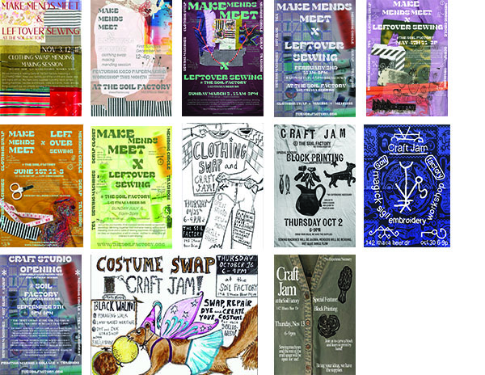

+++
title = "Craft Studio"
image = "img/banner.jpg"
thumb = "img/thumbnail.jpg"
summary = "**The Craft Studio** is an open workshop space that hosts **Craft Jams**. The Jams happen bi-weekly and are free-flowing evenings in which the sewing machines are open for use, and mending materials are available in an unstructured work environment. Regular additions to Craft Jams include the Linocut Station and Clothing Swaps."
+++

The Craft Studio is an open workshop space that hosts Craft Jams, which include sewing machines, a serger, mending circle, block printing, clothing swap, and a fabric scrap library. The Jams are hosted bi-weekly and are free-flowing evenings in which the machines are open for use, and mending materials are available in an unstructured work environment. Co-managers are present to help orient folks to the space and chat about projects, but skillsharing comes from within the community.  

Regular additions to Craft Jams include the Linocut Station for block printing jams, and Clothing Swaps where clothes are both swapped and mended, along with a variety of other craft related workshops. One-off special events we have hosted include:
 - Kozo papermaking workshop with Adam Bryan and Laura Rowley
 - Pants Fitting workshop with Ruth Collins 
 - Land-Heritage Black Walnut Foraging and Fabric-Dying workshop with Sheila Novak
 - Magick Sigil Embroidery with Artist-in-Residence Franz Bazin 

All of our Jams, Workshops and Special Events are publicized through the newsletter and on the calendar. Attend an event to join the newsletter!

## Static Spaces


**Leftover Sewing Laboratory**  
The Leftover Sewing Lab is a spinoff from an artist collective developed in 2018 in Berlin that revolved around bringing sewing machines and scrap together to have impromptu making sessions turning out sculptures, costumes and play materials. Upcycling textiles and open structured play are the driving forces behind Leftover Sewing. We continue to host this DIY space at the Soil Factory Craft Studio to provide guidance and advice on how to use sewing machines as a tool in your crafting vocabulary.  
*Hosted by Jackie*



**Make Mends Meet // MENDING CIRCLE**  
Established by Kathrin Achenbach, our mending circle is a continuation of her Make Mends Meet model. We invite folks to slow down and sit with us in the living room at the Soil Factory to learn hand stitches, and mend garments to give them new life. Kathrin instilled in us the spirit that mending is a radical act, focusing on slow crafting as community building, and giving new life to clothes that would otherwise go into landfills.  
*Hosted by the community*



**Linocut**  
The craft studio is home to a linocut station where art-makers can design and learn the meditative process of carving stamps. We provide inks, carving tools, and carving media such as upcycled linoleum flooring. Participants can use their stamp to make prints on a variety of donated papers, textiles, and clothing!  
*Hosted by Rohini*



**Clothing Swaps**  
Clothing Swaps are special events, hosted in conjunction with Craft Jams when the seasons change or the Soil Factory community calls for one. Swaps do not occur as one-to-one trades and you do not need to bring clothing in order to participate. Rather well-loved clothes are pooled and find new homes.  
*Hosted by Shay and Joey*


## Meet the Co-Managers

**Jackie (She/They)**:
Jackie is an interdisciplinary artist working between textiles, painting, woodworking and printmaking. Her work is motivated by building worlds and opening up opportunities for creation and play for folks of all ages. Jackie manages the Printmaking, Painting, and Drawing studios at Cornell AAP and established the Craft Studio.  
*jackie.ricc@gmail.com*

**Josi (They/Any)**:
Josi is an artist researching culture-change, and exploring a more-than-human social practice—how can creative material craft practices ground us in the present and cultivate a feeling of belonging in community and with the Earth? josi loves natural fibers and colors, and is excited to share wool working processes and their big dye pot at Craft Jams.  
*josiah.valleellis@gmail.com*

**Rohini (She/Her)**:
Rohini is a postdoctoral researcher at Cornell studying how to make water systems around the world more resilient under a changing climate. She is passionate about cultivating a space where art meets science to start conversations about how to support our community and planet. At the Soil Factory, she leads the linocut focal area of the Craft Studio space.  
*rg727@cornell.edu*

**Joey (They/Them)**:
Joey is a recent graduate of Ithaca College who enjoys many modes of crafting including sewing, knitting, painting and lino-printing, especially in regard to rescuing and repurposing abandoned goods. They help to run periodic Clothing Swaps in conjunction with Craft Jams.  
*joey.kwasnicki@gmail.com*

**Shay (They/Them)**:
Shay is an undergrad at Ithaca College studying environmental science. They work to explore the relationships between education, art, and transformative care as they pertain to food systems and nature. They co-host clothing swaps and craft jams at the Soil Factory.  
*smogge@ithaca.edu*

Have an idea or interested in hosting a guest workshop in the Craft Studio? Reach out to our co-managers with your ideas.

## Image Gallery

