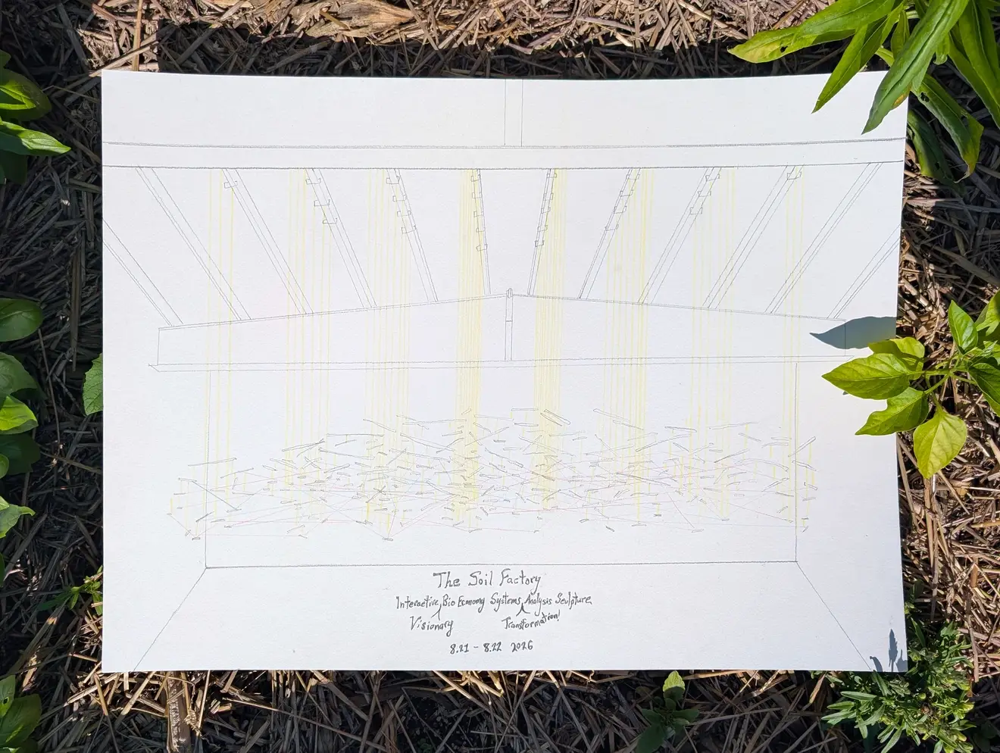
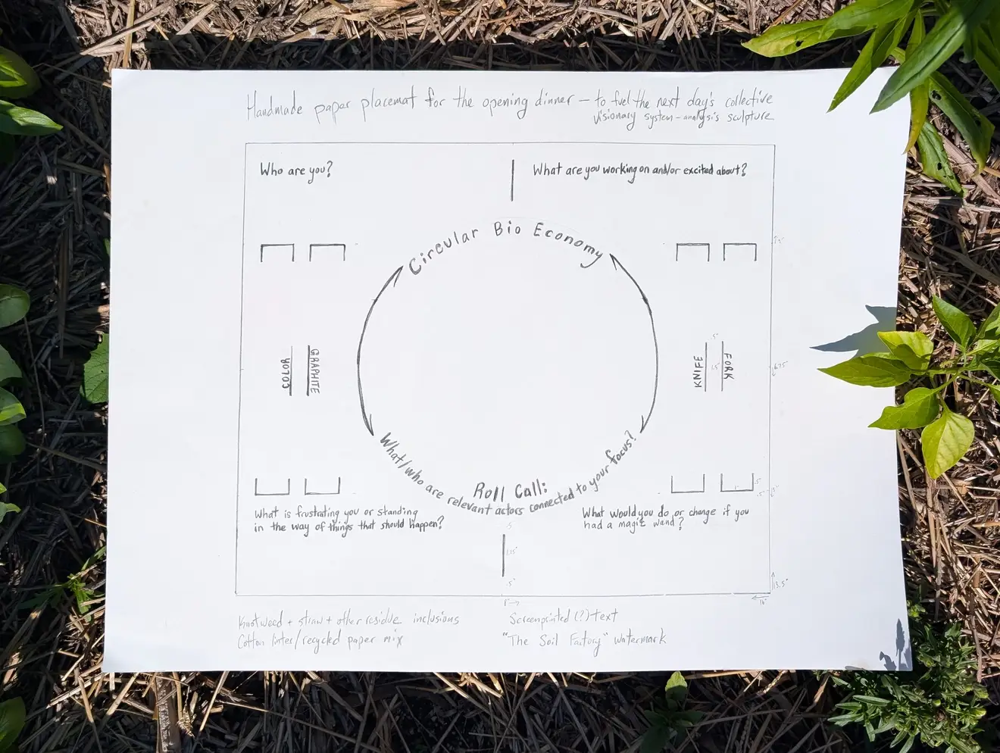
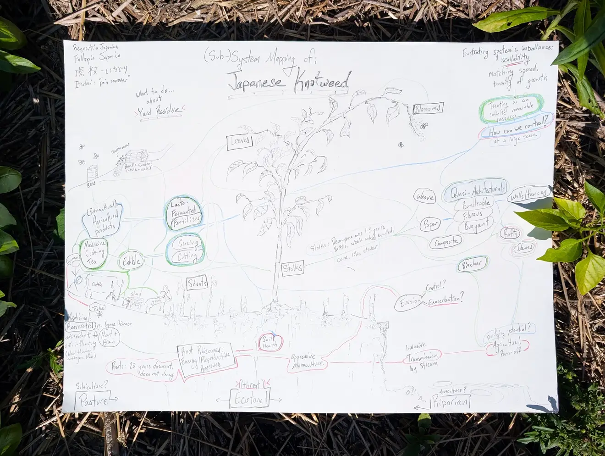

+++
title = "Advancing the Circular BioEconomy"
banner = "img/banner.webp"
thumb = "img/banner.webp"
order = 0
summary = """August 21–22, 2026

The gathering, “**Finding Synergies: Connecting People and Places to Advance the Circular BioEconomy,”** will bring together farmers, artists, scientists, community members, processors, researchers, and public agencies from New York, California, and Kenya to explore how circular approaches to organic residuals — including human excreta, livestock manure, food waste, and other biomass — can support more sustainable and equitable agrifood systems."""
+++



**August 21–22, 2026**

### Registration

We are pleased to invite you to a two-day event about the Circular Bioeconomy at the Soil Factory. The gathering, “**Finding Synergies: Connecting People and Places to Advance the Circular BioEconomy,”** will bring together farmers, artists, scientists, community members, processors, researchers, and public agencies from New York, California, and Kenya to explore how circular approaches to organic residuals — including human excreta, livestock manure, food waste, and other biomass — can support more sustainable and equitable agrifood systems. 

To help us plan meals and sessions, please let us know:  
* Whether you will attend the **community dinner and public panel on Friday, August 21**  -- open to all
* Whether you would like to participate in the **collaborative workshop on Saturday, August 22**  -- we’re expecting a smaller group



Please RSVP by **July 29** by replying to this email or contacting Rebecca (rjn7@cornell.edu) or Caitlyn (caitlyn.s.hatzell@gmail.com).

### Overview

During an **evening event on Friday 21 August**, we’ll share a catered dinner and engage with a  panel of representatives of bold initiatives related to the circular bionutrient economy research and implementation. Together they represent a diversity of conditions and strategies aimed at a shared goal: transforming organic by-products into valuable agricultural inputs. This is a public event, and all are invited.

On the **afternoon of Saturday 22 August**, a smaller group will dig into the broader circular bioeconomy, starting with lunch and an improvisational performance, followed by an afternoon of participatory systems mapping to create a collective system analysis. We will examine ways to reduce environmental harm, regenerate soils, and improve nutrient access. Our goal is to visualize valorization pathways and find links that can foster practical, cross-regional bio-nutrient strategies to turn underutilized organic materials into local value. Led by artist Adam Shulman, we will develop an interactive systems-transformation-analysis sculpture to help materialize these abstract considerations. Workshop participants will be invited to help shape the artwork's content, composition, and connections during the afternoon workshop, and thus to envision possible connections that may not have been obvious.

The significance of this work reaches beyond agriculture: the principles of circular economy apply to the broader bioeconomy and beyond, and systems analysis can reveal surprising connections wherever complex systems are in play. Participants will be invited into the kind of adaptive problem-solving that complex systems require, grappling together with questions that can help us come to collective answers: What are our goals and what are we doing to get there? What constrains us from achieving them? How can we connect to move toward better social, environmental and economic realities?

### Featured Panelists

With support from an X-Grant from the John D. and Catherine T. MacArthur Foundation\*, the program includes a public panel, shared meals, and a participatory workshop designed to deepen connections and advance practical, cross-regional strategies. All activities will take place at the Soil Factory, an art–science community space dedicated to bold, interdisciplinary dialogue.

**Featured Panelists for Friday evening:**

* **Will Tarpeh** (California) — [2025 MacArthur Fellow](https://www.macfound.org/videos/2025-macarthur-fellow-william-tarpeh), [Stanford Chemical Engineering](https://cheme.stanford.edu/people/william-tarpeh), [Tarpeh Lab](https://www.tarpehlab.com/people)  
* **Charles Midega** (Kenya) — [Poverty Health and Integrated Solutions](https://www.povertyhealth.org/prof-midega-phis-directorate/)  
* **Doug Young** (New York) — Spruce Haven Farm  
* **Eli Newell** (California) — [University of California \- Davis](https://ucanr.edu/people/eli-w-newell); [BioCircular Valley](https://biocirv.org/)  
* **Johannes Lehmann** (New York and Kenya) — Cornell University; [Johannes Lehmann | CALS](https://cals.cornell.edu/people/johannes-lehmann)   
* **Rebecca Nelson** (New York and Kenya) — Cornell University; MacArthur Fellow, 1996; [Rebecca Judith Nelson | CALS](https://cals.cornell.edu/people/rebecca-judith-nelson) 

### Tentative Program

*Wednesday–Thursday*  
Arrivals for long-distance participants

*Friday, August 21*

* Daytime: Optional workshop at Cornell on nutrient circularity frameworks (interested participants welcome)  
* 5:30 pm: Arrival and refreshments at the Soil Factory  
* 6:00 pm: Buffet dinner  
* 7:00 pm: Panel discussion  
* 8:00 pm: Participatory activity

*Saturday, August 22 — Workshop: Pathways to a Circular Bionutrient Economy*

* 12:00 pm: Arrival and lunch  
* 1:00–2:00 pm: Tour of the Soil Factory gardens  
* 2:00 pm: Reflections from Friday and presentation of workshop insights  
* 3:30 pm: Breakout groups (e.g., orchard systems, dairy, urban residues) to explore applications and synergies  
* 4:30 pm: Participatory systems mapping of organic residuals and soil health pathways  
* 6:00 pm: Pizza dinner and informal evening gathering (optional bonfire)

*Sunday*  
Departures for long-distance travelers

\*This event is part of the MacArthur Fellows program’s 45th anniversary.  In the words of our sponsor: ***Defying Boundaries: MacArthur Fellows at 45\.**  This moment calls for creative courage. For 45 years, MacArthur Fellows have expanded the boundaries of possibility by questioning conventions, crossing disciplines, and driving collective progress. Throughout 2026, the Foundation is celebrating the groundbreaking work of the Fellows and inspiring public dialogue through a series of nationwide events and conversations. Learn more at macfound.org/fellows-45.*