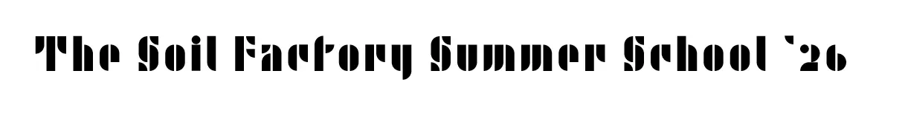
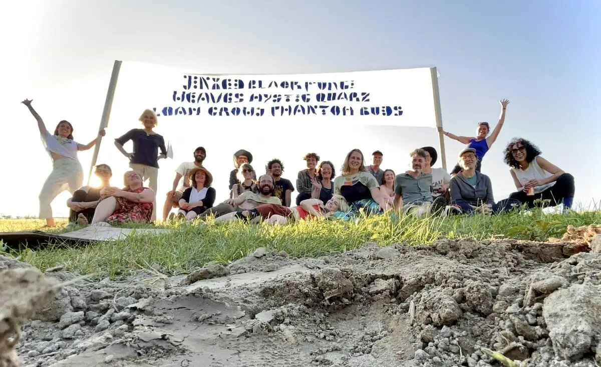
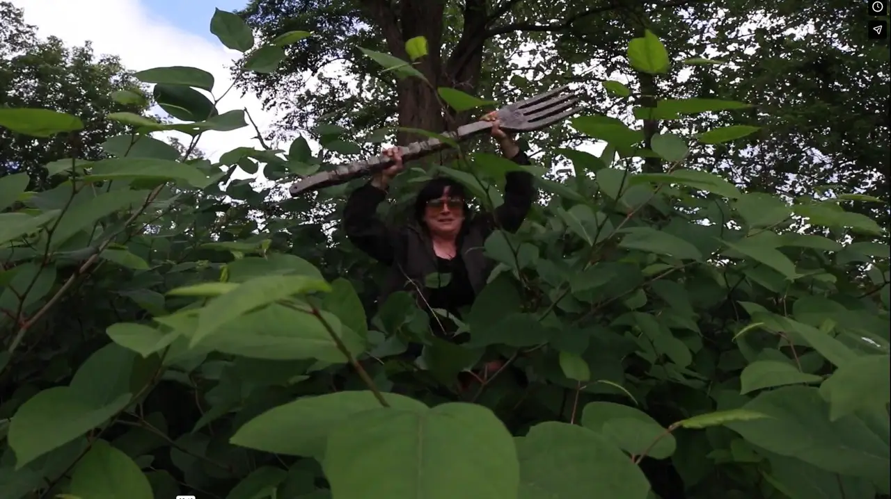

+++
title = "The Soil Factory Summer <del>School</del>"
banner = "img/banner.webp"
order = 1
summary = """June 14-21, 202

The Soil Factory Summer ~~School~~ is a creative project inspired by the legendary Black Mountain College that celebrates the 5-year anniversary of the Soil Factory Artist-in Residence program. It is an innovative experiment in creative collaborative art making that focuses on ‘process’ and ‘presence, not ‘product’. The uncertainty of what the group might be doing, whether it be an artwork, performance, celebration, interaction, publication, improvisation, ceremony, puzzle, meal, or some previously unimagined outcome led to all this,- and much more."""
+++

**June 14-21, 2026**

The Soil Factory Summer ~~School~~ is a creative project inspired by the legendary Black Mountain College that celebrates the 5-year anniversary of the Soil Factory Artist-in Residence program. It is an innovative experiment in creative collaborative art making that focuses on ‘process’ and ‘presence, not ‘product’. The uncertainty of what the group might be doing, whether it be an artwork, performance, celebration, interaction, publication, improvisation, ceremony, puzzle, meal, or some previously unimagined outcome led to all this,- and much more.

The Summer School also turned out to be an experiment in community involvement in a collective creative process that not only invites the community to witness or consume the output of artistic creativity, but to be active participants in the process. The project brought international and national artists to Ithaca to seed a community of purpose that we hope will redefine creative collectives and explore new ways of community engagement.

The schedule for each day of the Summer ~~School~~ centered on food: breakfast-lunch-dinner, and the rest evolved in a magical process.


## Participants in the Summer ~~School~~
**Who was there?**  
We were so lucky that over 30 creatives chose to descend on the Soil Factory for a full week of Summer ~~School~~, most of them from the Ithaca community, joined by alumnae/i from the artist-in residence program traveling from Los Angeles, San Francisco, Olympia, Boulder, Louisville, Detroit, Arcadia, Brooklyn, Philadelphia, from Berlin, Beirut and Binghamton.

**Leslie Rogers** (https://www.leslierogers.net/)  
**Kadallah Burrowes** (https://kadallah.com/)  
**Ella Ziegler** (www.ella-ziegler.de)  
**Debora Faccion-Grodzki** (https://www.facciongrodzki.com/)  
**Adam Shulman** (https://adamshulman.art/about)  
**Andrew Boghossian** (https://www.andrewboghossian.com/)  
**Rebecca Bird** (https://rebeccabird.info/About)  
**Ali Feser** (https://clarkson.edu/people/ali-feser)  
**Abby Banks** (https://www.abby-banks.net/about.html)  
**Elle W Hendrickson** (https://ellehendrickson.com/)  
**Abigail Collins** (http://abigailraphaelcollins.com/cvv)  
**Melissa Zarem** (https://www.melissazarem.com/)  
**Dan Torop** (https://dantorop.info/about.html)  
**Linda Weintraub** (https://lindaweintraub.com/)  
**Anna Ialeggio** (https://www.aialeggio.net/)  
**Nidaa Aboulhosn** (http://www.nidaaaboulhosn.com/)  
**Shanon Brooks** (https://shannonbrooks.cargo.site/)  
**Leslie Daniels** (https://www.lesliedaniels.com/)  
**Krisz Mosdossy** (https://www.evergreen.edu/directory/krisztina-Mosdossy)  
**Caitlyn Hatzell** (coordination)  
**Johannes Lehmann** (https://lehmannlab.cals.cornell.edu/)  
**Ash Ferlito** (coordination; https://www.ashferlito.com/)  
**Keith Mercovich** (the most intrepid food coordinator)  
**Sam Herr**  
**josi valle ellis**  
**Aimee Lehmann** (https://aimeelehmann.com/)  
**Kati Lustyik**  
**Kelly Presutti** (https://arthistory.cornell.edu/kelly-presutti)  
**Robbie Love**  
**Deanna Greene**  
**Shane Shine**  
**Helena**  
**Ulysses**  
**and many community members joining for pizza and potluck dinners, all-species pageant and the final day of festivities.**  
(Poster with introductions by participants)



## The Summer ~~School~~ Origins
**How did it start?**  
How did it start? The Summer ~~School~~ was conceived by Soil Factory members as a celebration of five years of the artist-in-residence program, inspired by Black Mountain College, and builds on the Soil Factory community as an inspiration of collective creativity. It started with lots of hellos and meeting old friends from years ago...



**The Summer ~~School~~ experiment unfolded**  
Visiting artists collaborated with local artists and community members at the Summer ~~School~~ to dig holes, build a “living room” made from fungi, compost and soil, char and bury a rocking chair, make a film (FRIENDSHIP-WATER-LOSS; watch for screenings\!), a writing workshop that provided the prompts for the film, develop a new font type on a banner that may become the new Soil Factory Font, make ceramic tubes and experiment with various dying techniques with iron and tannins exposed to cosmos and marigolds (the result you can also see hanging at Wide Awake Bakery in Ithaca, NY, in the month of July\!), Rebecca made water colors of the grounds, children drawing, a fantastic plant pageant of all species, several performances around meals, including Symbiotic-Synergistic Salad, Soil Food Web, and Nixtamal Tacos. There were giant cyanotypes, imagining a shade pavilion (also known as a perabola-pergola…) to start an artist colony on the Soil Factory hill.




Elle W Hendrickson collected and assembled the story **Friendship-Water-Loss** by the Soil Factory Summer School 2026, with the only guideline: we had to be done by sunset,- here it is:
