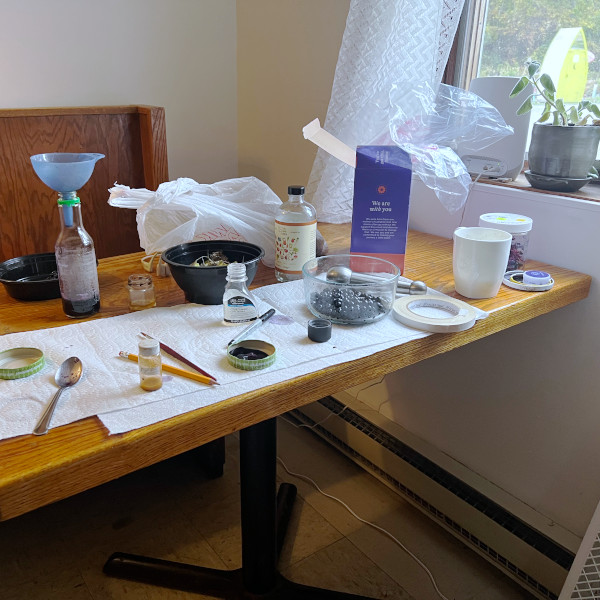

+++
title = "Residencies"
banner = "img/banner.jpg"
+++


We are experimenting with innovative approaches to bring people together to generate connections for a sustainable future. Our residency program started in November 2021 and provides access to the land and programming at The Soil Factory. Residencies are open to anyone who is interested in engaging with the community at The Soil Factory, including but not limited to artists, scientists, musicians, ecological practitioners, and community organizers.

Artists-in-residence harvest clay from our local soil to make ceramics; participate in art/nature events in our meadow and garden areas; join on-site sustainability-focused mending circles, barter markets, and re-use crafting events; participate in weekly darkroom and cyanotype sessions; engage in child-centered art explorations; and host film nights. These interactions cultivate the practice of our visitors just as much as they bring to our community the chance to see and experience innovative art from outside the scope of our rural Ithacan life.

Residents often first come to Ithaca for an initial site visit of a few days, in order to get a sense of this place and its community. Then there is the possibility to spend more time here, with 1-2 weeks being the duration of a typical residency. We are excited when residents keep returning to embark on other projects here. We have invited back prior resident artists to participate in our [2026 Summer School](../events/summer-school/), an experimental event in the spirit of Black Mountain College and the Soil Factory.

A few examples where exciting networks started to expand in unexpected ways, are listed below...


## Artists-in-residence
  
Here are some artists who have visited us:

[Nidaa Aboulhosn](https://www.nidaaaboulhosn.com/about) (photography/drawing/time-based – Lebanon/NY)

[Kathrin Achenbach](https://annekata.com/) (thread/ink/fabric – Andalusia, Spain)

[Alvaro Azcarraga](https://alvaroazcarraga.com/Information) (artist/researcher – New York)

[Abby Banks](https://www.abby-banks.net/about.html) (sculpture/photography/film/presentation/publication – San Francisco)

[Marilyn Boror Bor](https://marilynboror.com/) (language/memory/feminism/earth – Guatemala)

[Daniel Bozhkov](https://www.danielbozhkovart.com/) (visual & performance – NYC)

[Shannon Brooks](https://movementresearch.org/people/shannon-brooks/) (performance/multidisciplinary artist – Philadelphia)

[Paolo Buggiani](https://paolobuggiani.com/) (performance artist – Rome, Italy)

[Sari Carel](https://www.saricarel.com/about) (multimedia artist – NYC)

[Nicole Chochrek](https://nicolechochrek.com/) (interdisciplinary artist – Buffalo)

[Rachel Garber Cole](https://www.rachelgarbercole.com/about) (visual artist – NYC)

[Abigail Raphael Collins](http://abigailraphaelcollins.com/) (video artist – Los Angeles, CA)

[Patrick Costello](https://www.patrickjcostello.net/about) (visual & landscape art – NYC)

[marlo de Lara](https://marlodelara.squarespace.com/) (sound/film – UK/Baltimore/LA)

[dean erdmann](https://artsandhumanities.ucsd.edu/academics/new-faculty/2022/dean-erdmann.html) (visual/media artist – San Diego, CA)

[Mauricio Esquivel](https://www.mauricioesquivel.com/about/) (sculptor/etc. – NYC)

[Matthew Fenn](https://cals.cornell.edu/people/matthew-fenn) (photography/plants – Ithaca)

[Ash Ferlito](https://www.ashferlito.com/) (sculpture/printmaking/rewidling – Ithaca)

[Maxwell Fertik](https://maxwellfertik.com/) (multidisciplinary artist and designer – Indiana)

[Abrie Fourie](https://www.abriefourie.com/info/) (Berlin, South Africa)

[Rachel Frank](https://www.rachelfrank.com/) (sculpture/video/performance – NYC)

[Andrew Freiband](https://www.artistsliteracies.org/aboutus) (art/science intersection – NYC)

[Dylan Gauthier](https://www.thesunview.org/) (artist/curator/educator – NYC)

[Lyn Goeringer](https://www.lyngoeringer.com/portfolio/) (composer, sound artist – Baltimore)

[Debora Faccion Grodzki](https://www.facciongrodzki.com/) (expanded painting – Ithaca)

[José Buenaventura Gonzalez Gutierrez](https://www.mexicanweaver.com/) (weaver – Oaxaca)

Ali Feser (anthropology – Potsdam/Binghamton)

[Elle Hendrickson](https://ellehendrickson.com/about/) (sculpture and visual artist – KY)

[Fritz Horstman](http://www.fritzhorstman.com/) (sound and visual artist – Bethany, CT)

[Kathy High](https://www.kathyhigh.com/) (technology/art/biology – Troy, NY)

[Anna Ialeggio](https://www.aialeggio.net/) (artist/peformer – Bar Harbor, ME)

[Ellie Irons](https://ellieirons.com/) (urban ecology – Troy, NY)

[Lucy Kerr](https://metrograph.com/lucy-kerr-interview/) (filmmaker and video/performance artist – Syracuse)

[Nance Klehm](https://socialecologies.net/cms/social-ecologies/about-us/) (land systems designer, soil scientist – Freeport, IL)

[Annamariah Knox](https://annamariahknoxstudio.com/about) (textiles, soft sculpture, video, and movement – NYC)

[Hae Ahn Kwan](https://www.haeahnkwon.com/) (visual artist – Halifax, Canada)

Jonas Kyle (sculpture/painting/theater – NYC)

[Z. Cecilia Lu](https://zcecilialu.com/cv) (sculpture/ceramic/organic – Troy, NY)

Amanda Miller (theater – NYC)

Maria Mironova (photography – New York)

Ilse Sørensen Murdock (painting – NYC)

[Nobuho Nagasawa](https://nobuhonagasawa.com/) (transdisciplinary artist – Stony Brook)

[Sarah Nahar](https://www.sarahnahar.com/) (environmental scholar – Syracuse, Ann Arbor)

[Landon Newton](https://landon-newton.com/) (plants – NYC)

[Donna Oblongata](https://www.donnaoblongata.com/) (theater artist – Philadelphia, PA)

[Linda O’Keefe](https://www.lindaokeeffe.com/) (sound artist – NYC)

[Ian Page](https://ianpage.net/) (visual artist – Provincetown/LA)

[Magda Pios](https://pl.linkedin.com/in/magdalena-pios-1b2b21a5) (architect – Warsaw, Poland)

Sonia Ramirez (sculpture/graffiti/installation artist – NYC)

[Leslie Rogers](https://www.leslierogers.net/) (textile/puppetry/fermentation – Detroit, MI)

[Stephanie Rothenberg](https://stephanierothenberg.com/) (interdisciplinary artist – Buffalo)

[Barnaby Ruhe](https://www.barnabyruhe.org/bio) (painting – NYC)

[Silvia Ruzanka](https://silviaruzanka.com/) (media artist – Albany)

Neil Schill (photography – Andalusia, Spain)

[Dave Seidel](https://mysterybear.net/contact/) (composer/performer – Peterborough, NH)

[Shawn Shafner](https://www.shawnshafner.com/) (theater – Washington, DC)

[Adam Washiyama Shulman](https://adamshulman.art/about) (ecological sculpture, theatrical design, and performance – Ithaca)

Dan Shulman (music – France)

[Amanda Simson](https://engfac.cooper.edu/asimson) (science/art – NYC)

[Alek Slon](https://www.alekslon.com/) (visual and video art – Warsaw, Poland)

[Ashley Teamer](https://ashleyteamer.com/) (visual/sound artist – New Orleans, NYC)

[Suzanne Thorpe](https://www.suzannethorpe.com/) (composer/performer – Catskills)

[Pietro Varrasso](https://lavauzelle.org/intervenants/pietro-varrasso/) (director/actor – Liège, Belgium)

[Sacha Yanow](https://www.sachayanow.com/) (actor, performance artist, organizer – NYC)

[Ella Ziegler](http://www.ella-ziegler.de/) (Berlin, DE)


## Interested in the Residency?  
If you want to visit or know someone you want to invite, get in touch with [soilfactoryevents@gmail.com](mailto:soilfactoryevents@gmail.com). It would help to send a half page or so telling us who you are, what kind of work you do, why you are particularly interested in the Soil Factory, and the rough time frame you would like to be considered for coming.  The artist and residence organizing group will write back, but be prepared for a long lag before a response. If you’re interested in the residency, do consider joining our newsletter and bulletin listserv. That is a good way to learn more about the range of happenings at the Soil Factory.
